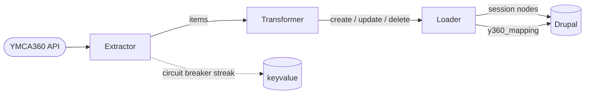

# YMCA360 Integration

<table align="left"><tr><td><h2>🇺🇦</h2></td><td>This module is maintained by Ukrainian developers. Please consider <a href="https://supportukrainenow.org">supporting Ukraine</a> in a fight for their freedom and the safety of Europe.</td></tr></table>

<br clear="all"/>

Pulls YMCA360 schedule occurrences (in-studio + live stream) into the [YMCA Website Services](https://github.com/YCloudYUSA/yusaopeny) Program Event Framework as `session` nodes, using a windowed, reconciliation-based syncer.

- 🔍 Read our [getting-started instructions](https://github.com/YCloudYUSA/yusaopeny#installation)
- 📖 Search the [documentation](https://ds-docs.y.org/docs/)
- 🤝 Review [community resources](https://ds-docs.y.org/community/)

## Table of contents

- [Highlights](#highlights)
- [Requirements](#requirements)
- [Installation](#installation)
- [Configuration](#configuration)
- [How it works](#how-it-works)
- [Drush commands](#drush-commands)
- [Upgrading](#upgrading)
- [Development](#development)
- [Maintainers](#maintainers)

## Highlights

| | |
|---|---|
| **Windowed sync** | Native API filters (`start_at`, `end_at`, `scheduled_from`) — fetches only the next N days, no client-side cap, no unbounded paging. |
| **Source-of-truth reconciliation** | Mappings missing from the current extract are flagged as orphans and removed. Cap (`max_deletes_per_run`, default 500) protects against misconfigurations. |
| **Empty-extract circuit breaker** | Skips orphan reconciliation until N consecutive empty extracts confirm emptiness — prevents a single API blip from wiping the schedule. |
| **Trash-aware deletes** | Deletes are wrapped in `trash.manager->executeInTrashContext('ignore', …)` so reconciliation performs real deletes instead of soft-trashing. |
| **Configurable canceled UX** | Canceled occurrences stay published with a `CANCELED:` prefix by default, mirroring the Y360 app behaviour. |
| **Optional theming hooks** | Writes `field_session_status` and `field_session_original_instructor` when the `session` bundle exposes them, letting themes apply strikethrough or substitute-instructor labels. |
| **Drush surface** | `y360:status`, `y360:sync`, `y360:reset-hashes`, `y360:ping` — operators no longer need `php:eval`. |

## Requirements

| Requirement | Version |
|---|---|
| Drupal core | `^11` |
| YMCA Website Services (`yusaopeny`) | `11.x` |
| [`drupal/trash`](https://www.drupal.org/project/trash) | optional, recommended |

> [!NOTE]
> When the `trash` module is present, the syncer detects `trash.manager` at runtime and bypasses soft-delete during reconciliation only — user-initiated deletes of other bundles continue to be captured by Trash.

## Installation

```bash
composer require ycloudyusa/yusaopeny_ymca360
drush en yusaopeny_ymca360 yusaopeny_ymca360_instudio -y
drush updb -y
```

The submodule's install hook adds `yusaopeny_ymca360_instudio.syncer` to `ymca_sync.settings.active_syncers` and (when the `trash` module is enabled) removes syncer-owned bundles from `trash.settings.enabled_entity_types.node` so reconciliation deletes are real.

<details>
<summary><strong>Update hooks</strong> (run on existing installs after upgrade)</summary>

| Hook | Purpose |
|---|---|
| `yusaopeny_ymca360_instudio_update_10001` | Backfills the new sync settings (`window_days`, `page_size`, `max_deletes_per_run`, `canceled_title_prefix`, `canceled_publish_behavior`) when missing. |
| `yusaopeny_ymca360_instudio_update_10003` | Backfills `sync.window_offset_days = 1` so already-started occurrences stay in the window. |
| `yusaopeny_ymca360_instudio_update_10002` | Removes the syncer-owned bundles (`session`, `activity`, `class`, `program`, `program_subcategory`) from `trash.settings.enabled_entity_types.node` if Trash is enabled and tracks nodes. Other bundles the site has opted into Trash for are preserved. |

</details>

## Configuration

### `Administration » YMCA Website Services » Integrations » YMCA360`

- **Credentials & Schedules** — API credentials and the `schedule_id` allow-list (Group Fitness, Pool, Racquetball, etc.).
- **Locations mapping** — maps Y360 branches and studios onto site location nodes.

### `Administration » YMCA Website Services » Integrations » YMCA360 In-Studio`

<details>
<summary><strong>Automatic Sync</strong></summary>

| Setting | Default | Notes |
|---|---|---|
| `enable_cron` | off | When on, the submodule's `hook_cron` runs the syncer on every Drupal cron tick. |

</details>

<details>
<summary><strong>Sync Window</strong></summary>

| Setting | Default | Notes |
|---|---|---|
| `window_days` | `14` | How many days ahead of `now` to pull. Combined with `window_offset_days`, the extracted window is `[midnight - window_offset_days days, now + window_days]`. |
| `window_offset_days` | `1` | How many days *before* `now` to include. Keeps occurrences that already started but have not yet ended (e.g. an Open Swim 5am–5pm at 11am) inside the window so reconciliation does not delete them as orphans. Set to `0` to revert to the pre-2.x behaviour where any occurrence with `start_at < now` is dropped immediately. Increase if you run multi-day occurrences. |
| `page_size` | `500` | Items per API page. Larger pages = fewer requests but more memory per request. |
| `max_deletes_per_run` | `500` | Hard cap on deletions per sync cycle. Excess is logged and deferred to subsequent runs. Set to `0` to disable. |
| `empty_extract_threshold` | `2` | How many consecutive empty extracts must occur before reconciliation runs against an empty set. Lower it to `1` to disable the circuit breaker. |

</details>

<details>
<summary><strong>Canceled sessions</strong></summary>

| Setting | Default | Notes |
|---|---|---|
| `canceled_title_prefix` | `CANCELED: ` | Prepended to the session title when the occurrence is canceled. Empty string = no prefix. |
| `canceled_publish_behavior` | `keep_published` | One of `keep_published` (canceled stays visible with prefix), `follow_api` (respects API `published` flag), `always_unpublish` (hides canceled). |

</details>

> [!TIP]
> After changing `canceled_publish_behavior` or `canceled_title_prefix`, run `drush y360:reset-hashes` so the next sync rewrites session nodes instead of skipping them via the hash no-op path.

## How it works



- **Extractor** builds the `[midnight - window_offset_days days, now + window_days]` window and calls `Y360Client::getSchedulesWindowed()` with the API's native filters. Pagination is API-driven. Tracks consecutive empty extracts in the `yusaopeny_ymca360_syncer` keyvalue collection and toggles `DataWrapper::skipOrphanReconciliation` until emptiness is confirmed.
- **Transformer** classifies the working set:
  - `status=deleted` → existing mapping queued for delete.
  - hash matches existing mapping → no-op (unchanged item).
  - hash differs → update.
  - no existing mapping → create.
  - mappings whose `y360id` is missing from the current extract → orphan, queued for delete (capped, may be skipped by the circuit breaker).
- **Loader** creates or updates `session` nodes via `applySessionFields()` (title with optional cancel prefix, class/activity, time paragraph, location, room, instructor, description, ages, optional fields). Publish state derives from `isPublishedSession()`. Deletes are wrapped in `trash.manager->executeInTrashContext('ignore', …)`.

The hash on each `y360_mapping` row is `md5(serialize($apiItem))` so any field change in the upstream item triggers an update on the next sync.

> [!NOTE]
> Under the hood the module uses [YMCA Sync](https://github.com/YCloudYUSA/ymca_sync). When the syncer runs on Drupal cron, run cron often (e.g. every 15 minutes). Sites that prefer an explicit job runner can wire one with `drush y360:sync`.

## Drush commands

| Command | Alias | Purpose |
|---|---|---|
| `drush y360:status` | `y360-st` | Snapshot of mapping counts (total, in-window, past, future, blank-hash), key config values, last cron run. |
| `drush y360:sync [--syncer=…]` | `y360-sync` | Runs the syncer once. Defaults to `yusaopeny_ymca360_instudio.syncer`. |
| `drush y360:reset-hashes` | `y360-rh` | Clears `hash` on every mapping row so the next sync re-applies session fields. |
| `drush y360:ping` | `y360-ping` | Pings the YMCA360 API and prints a one-line OK / failure message. |

## Upgrading

> [!IMPORTANT]
> **`2.0.0` is a breaking release.** Drupal 10 support is dropped (`core_version_requirement: ^11`). The legacy `Y360Cleaner` service, the `yusaopeny_ymca360_cron` hook, and the `drush y360:cleanup` command have been removed — reconciliation now handles past mappings as part of every sync run.

<details>
<summary><strong>1.x → 2.0.0 checklist</strong></summary>

- [ ] Site is on Drupal 11.
- [ ] `composer require ycloudyusa/yusaopeny_ymca360:^2.0`
- [ ] `drush updb -y` — applies `update_10001` (settings backfill) and `update_10002` (Trash bundle exclusion).
- [ ] Verify `drush y360:status` shows the expected window and counts.
- [ ] Run `drush y360:sync` once and check the watchdog channel `yusaopeny_ymca360_syncer`.
- [ ] If you maintained a custom `ExtractorBase` subclass, update its constructor — a `KeyValueFactoryInterface` argument was added.

</details>

## Development

The module ships with no `version:` field in `composer.json`. Composer resolves the package version from the latest git tag — keep it that way and tag releases off `2.x`.

The pipeline is wired through three abstract base services (`yusaopeny_ymca360.{extractor,transformer,loader}`) that submodules extend via `parent:` references in their own `*.services.yml`. See `modules/yusaopeny_ymca360_instudio/yusaopeny_ymca360_instudio.services.yml` for the canonical example.

Logs land in the `yusaopeny_ymca360_syncer` channel; tail with:

```bash
drush ws --type=yusaopeny_ymca360_syncer --extended
```

## Maintainers

- [Andrii Podanenko (`podarok`)](https://www.drupal.org/u/podarok)
- [Vlad Sadretdinov (`svicervlad`)](https://github.com/svicervlad)
- [Andrey Maximov (`andreymaximov`)](https://www.drupal.org/u/andreymaximov)
- [Five Jars](https://fivejars.com/)

Issues and pull requests live at <https://github.com/YCloudYUSA/yusaopeny_ymca360>.

## Acknowledgements

The `2.0.0` release — windowed sync, reconciliation, Trash-aware deletes, configurable canceled UX, drush commands — was sponsored by [YMCA of Northern Colorado](https://ymcanoco.org/) and delivered by [ITCare](https://itcare.company/).
